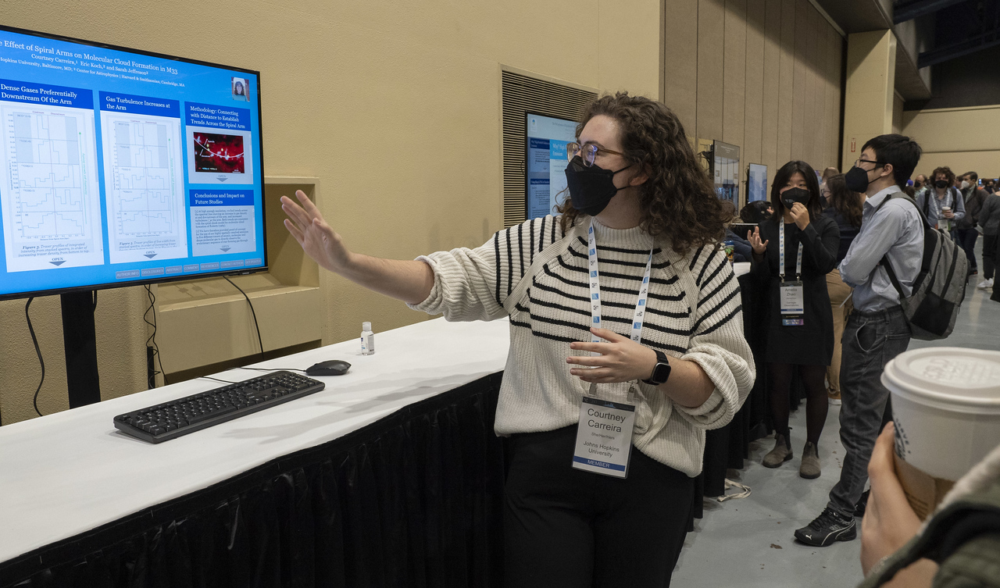

## About Me

I am a first-year graduate student at the University of California, Santa Cruz, in the Department of Astronomy and Astrophysics. I am an observational astronomer, with a particular interest in star formation and its associated processes. Currently, I'm working with Professor Brant Robertson in the [UCSC Computational Astrophysics](https://robertson.sites.ucsc.edu/) group, using data from the [JWST Advanced Deep Extragalactic Survey (JADES)](https://jades-survey.github.io/) to study star formation extragalactically.

I'm also working with Eric Koch and Sarah Jeffreson at the Center for Astrophysics \| Harvard & Smithsonian on a project studying the effect of spiral structure on molecular cloud and star formation.

I earned my Bachelor of Science in Physics, with a minor in Applied Mathematics & Statistics, from Johns Hopkins University in May 2023.

In my free time, I enjoy cooking and baking - along the way, I'm digitizing all of my family's old recipes from Cuba!



---

*Courtney ~~gesturing wildly at~~ presenting her iPoster at the AAS Winter Meeting in January 2023, in Seattle, WA. (Photo by © CorporateEventImages/Todd Buchanan 2023.)*

---

<!-- ## Research

include link to ADS again

## Outreach & Teaching -->

## Contact

Email: [ccarreir@ucsc.edu](mailto:ccarreir@ucsc.edu)

Office: UCSC Main Campus, Interdisciplinary Sciences Building, Office 255

Mail:
&nbsp; &nbsp; Courtney Carreira
&nbsp; &nbsp; MS: UCO / Lick Observatory
&nbsp; &nbsp; 1156 High Street
&nbsp; &nbsp; Santa Cruz, CA 95060

<!-- Science Digest info, info in layman's terms and contact about public talks -->