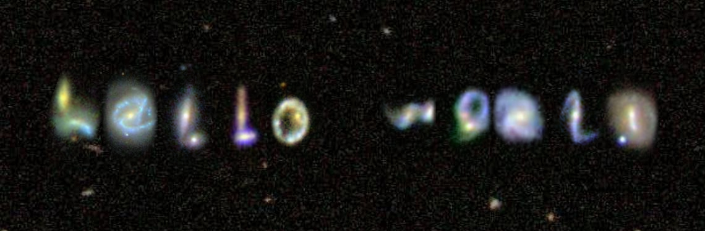

## About Me

I am an observational astronomer, with a particular interest in star formation and its associated processes.

I am a second-year PhD student at the University of California, Santa Cruz, in the Department of Astronomy and Astrophysics. Currently, I'm working with Professor Brant Robertson in the [UCSC Computational Astrophysics](https://robertson.sites.ucsc.edu/) group, using data from the [JWST Advanced Deep Extragalactic Survey (JADES)](https://jades-survey.github.io/) to study star formation extragalactically through the lens of galaxy morphology.

I'm also working with Eric Koch and Sarah Jeffreson at the Center for Astrophysics \| Harvard & Smithsonian on a project studying the effect of spiral structure on molecular cloud and star formation, which I started as a [SAO Astronomy REU](https://www.cfa.harvard.edu/opportunities/graduate-undergraduate-programs/reu-summer-intern-program) intern in Summer 2022.

I earned my Bachelor of Science in Physics, with a minor in Applied Mathematics & Statistics, from Johns Hopkins University in May 2023.

In my free time, I enjoy cooking and baking - along the way, I'm digitizing all of my family's old recipes from Cuba!



---

*Courtney ~~gesturing wildly at~~ presenting her iPoster at the AAS Winter Meeting in January 2023, in Seattle, WA. (Photo by © CorporateEventImages/Todd Buchanan 2023.)*

---

<!-- ## Research

include link to ADS again

## Outreach & Teaching -->

## In the Press

I was featured in ["Catching Ancient Stars Beyond Space and Time"](https://ucscsciencenotes.com/feature/catching-ancient-stars-beyond-space-and-time/) by [Chiara Villanueva](https://www.chiaravillanueva.com/), a graduate of the Science Communication Master's Program at UC Santa Cruz. This project included a podcast interview, ["Conducting Science with the James Webb Space Telescope as an Early-Career Researcher"](https://soundcloud.com/scicom-slugs/conducting-science-with-jwst-as-an-early-career-researcher?in=scicom-slugs/sets/scicom-podcasts-2020-2022&si=814391b9e52c41189ccf59a323bb1d13&utm_source=clipboard&utm_medium=text&utm_campaign=social_sharing).

You can hear me, and many other astronomers, describe the impact of the James Webb Space Telescope on studies of the universe in this video, ["The James Webb Space Telescope Reveals the Early Universe"](https://www.youtube.com/watch?v=gCiVrAFz9P0), put together by the Space Telescope Science Institute.

## Contact

Email: [ccarreir@ucsc.edu](mailto:ccarreir@ucsc.edu)

Office: Interdisciplinary Sciences Building, Office 291

Mailing Address:  
&nbsp; &nbsp; Courtney Carreira  
&nbsp; &nbsp; MS: UCO / Lick Observatory  
&nbsp; &nbsp; 1156 High Street  
&nbsp; &nbsp; Santa Cruz, CA 95060

<!-- Science Digest info, info in layman's terms and contact about public talks -->

---
Looking for a fun galaxies-related activity? I'm a huge fan of [http://mygalaxies.co.uk/](http://mygalaxies.co.uk/), which lets you write any text message in real SDSS galaxy images!

