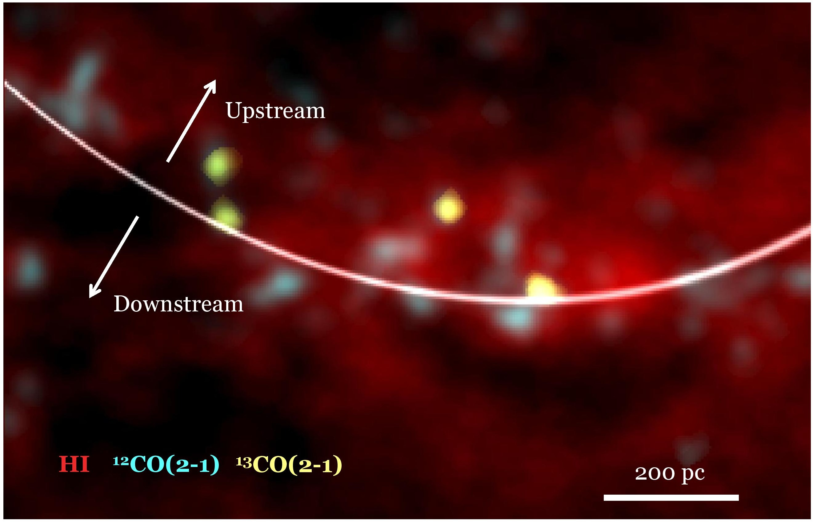
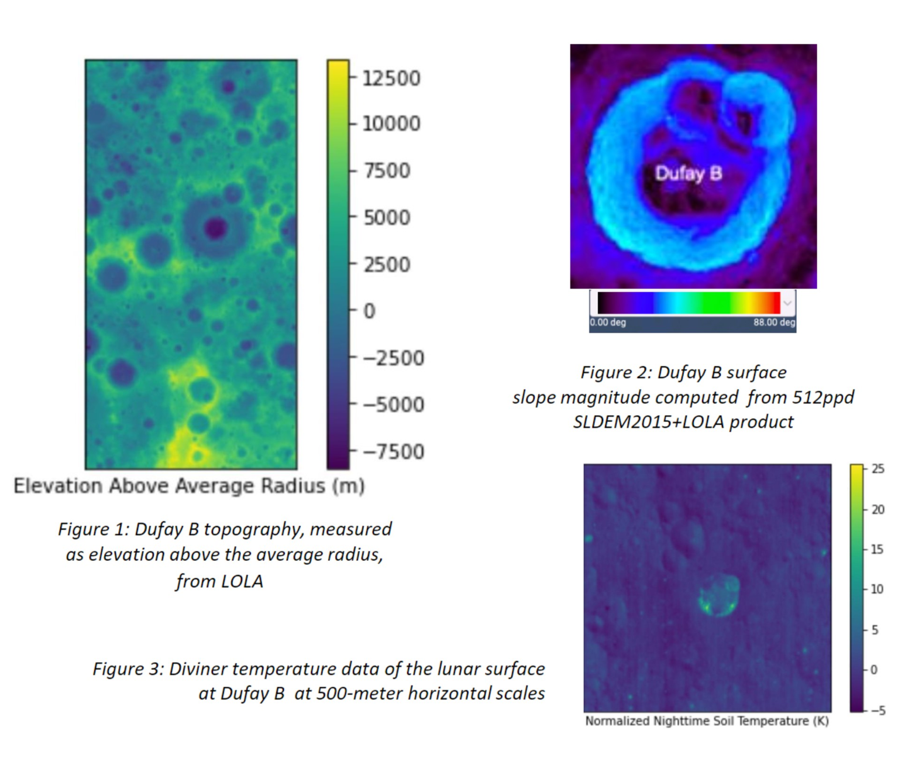
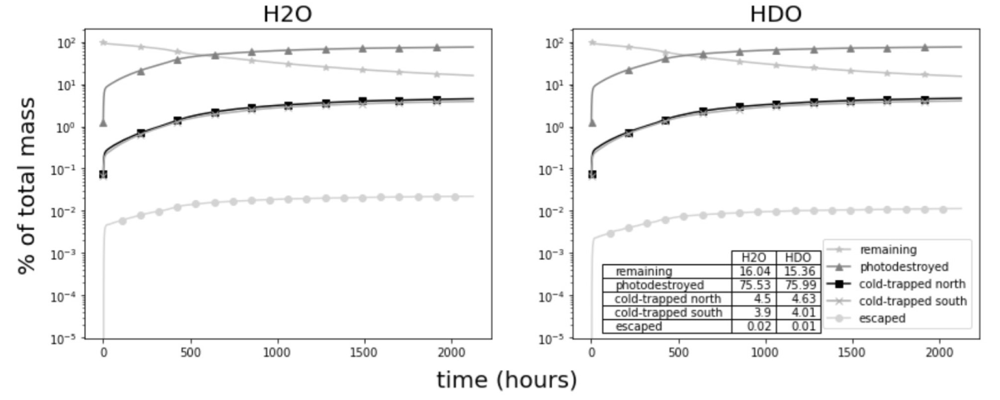

<h2 id="publications" style="margin: 2px 0px -15px;">Publications</h2>

<ol class="bibliography">
    
<li>

  

    
  

  

    
{The Effect of Spiral Arms on Molecular Cloud Formation in M33}

    
{Carreira}, Courtney and {Koch}, Eric and {Jeffreson}, Sarah

    
<em>American Astronomical Society Meeting Abstracts, January 2023.</em>

    

      <a href= class="btn btn-sm z-depth-0" role="button" target="_blank" style="font-size:12px;">PDF</a>
      <a href= class="btn btn-sm z-depth-0" role="button" target="_blank" style="font-size:12px;">Code</a>
      <a href= class="btn btn-sm z-depth-0" role="button" target="_blank" style="font-size:12px;">Project Page</a>
      <a href=https://baas.aas.org/pub/2023n2i211p01/release/1 class="btn btn-sm z-depth-0" role="button" target="_blank" style="font-size:12px;">Source</a>
      <a href= class="btn btn-sm z-depth-0" role="button" target="_blank" style="font-size:12px;">Supplemental</a>
      <a href= class="btn btn-sm z-depth-0" role="button" target="_blank" style="font-size:12px;">Video</a>
      <a href=https://ui.adsabs.harvard.edu/abs/2023AAS...24121101C/exportcitation class="btn btn-sm z-depth-0" role="button" target="_blank" style="font-size:12px;">BibTex</a>
    

  

</li>
        
<li>

  

    
  

  

    
{Lunar Crater Maturity Analysis in Python: Developing a Toolkit for Ejecta Analysis}

    
{Carr}, K.~A.~C. and {Azubuike}, O.~A. and {Tran}, A.~T. and {Carreira}, C.~C. and {Alfaro}, C.~A. and {Greenhagen}, G.~B. and {Patterson}, G.~W.~P. and {Stickle}, A.~M.~S. and {Prem}, P.~P. and {Cahill}, J.~T.~S.~C. and {Tai Udovicic}, C.~J.~T.~U.

    
<em>5th Planetary Data Workshop \& Planetary Science Informatics \& Analytics, June 2021.</em>

    

      <a href=https://www.hou.usra.edu/meetings/planetdata2021/pdf/7087.pdf class="btn btn-sm z-depth-0" role="button" target="_blank" style="font-size:12px;">PDF</a>
      <a href= class="btn btn-sm z-depth-0" role="button" target="_blank" style="font-size:12px;">Code</a>
      <a href= class="btn btn-sm z-depth-0" role="button" target="_blank" style="font-size:12px;">Project Page</a>
      <a href= class="btn btn-sm z-depth-0" role="button" target="_blank" style="font-size:12px;">Source</a>
      <a href= class="btn btn-sm z-depth-0" role="button" target="_blank" style="font-size:12px;">Supplemental</a>
      <a href= class="btn btn-sm z-depth-0" role="button" target="_blank" style="font-size:12px;">Video</a>
      <a href=https://ui.adsabs.harvard.edu/abs/2021LPICo2549.7087C/exportcitation class="btn btn-sm z-depth-0" role="button" target="_blank" style="font-size:12px;">BibTex</a>
    

  

</li>
        
<li>

  

    
  

  

    
{Lunar Crater Maturity Analysis in Python: Developing a Toolkit for Ejecta Analysis}

    
{Carr}, K.~A.~C. and {Azubuike}, O.~A. and {Tran}, A.~T. and {Carreira}, C.~C. and {Alfaro}, C.~A. and {Greenhagen}, B.~T.~G. and {Patterson}, G.~W.~P. and {Stickle}, A.~M.~S.

    
<em>52nd Lunar and Planetary Science Conference, March 2021.</em>

    

      <a href=https://www.hou.usra.edu/meetings/lpsc2021/pdf/2387.pdf class="btn btn-sm z-depth-0" role="button" target="_blank" style="font-size:12px;">PDF</a>
      <a href= class="btn btn-sm z-depth-0" role="button" target="_blank" style="font-size:12px;">Code</a>
      <a href= class="btn btn-sm z-depth-0" role="button" target="_blank" style="font-size:12px;">Project Page</a>
      <a href= class="btn btn-sm z-depth-0" role="button" target="_blank" style="font-size:12px;">Source</a>
      <a href= class="btn btn-sm z-depth-0" role="button" target="_blank" style="font-size:12px;">Supplemental</a>
      <a href= class="btn btn-sm z-depth-0" role="button" target="_blank" style="font-size:12px;">Video</a>
      <a href=https://ui.adsabs.harvard.edu/abs/2021LPI....52.2387C/exportcitation class="btn btn-sm z-depth-0" role="button" target="_blank" style="font-size:12px;">BibTex</a>
    

  

</li>
        
<li>

  

    
  

  

    
{The Effect of Isotopic Composition and Surface Residence Times on Lunar Volatile Transport}

    
{Alfaro}, C. and {Tran}, A. and {Carr}, K.~A. and {Azubuike}, O. and {Carreira}, C. and {Prem}, P. and {Dominguez}, G. and {Greenhagen}, B.~T. and {Hurley}, D.~M. and {Stickle}, A.~M. and {Patterson}, G.~W. and {Cahill}, J.~T.~S.

    
<em>52nd Lunar and Planetary Science Conference, March 2021.</em>

    

      <a href=https://www.hou.usra.edu/meetings/lpsc2021/pdf/2258.pdf class="btn btn-sm z-depth-0" role="button" target="_blank" style="font-size:12px;">PDF</a>
      <a href= class="btn btn-sm z-depth-0" role="button" target="_blank" style="font-size:12px;">Code</a>
      <a href= class="btn btn-sm z-depth-0" role="button" target="_blank" style="font-size:12px;">Project Page</a>
      <a href= class="btn btn-sm z-depth-0" role="button" target="_blank" style="font-size:12px;">Source</a>
      <a href= class="btn btn-sm z-depth-0" role="button" target="_blank" style="font-size:12px;">Supplemental</a>
      <a href= class="btn btn-sm z-depth-0" role="button" target="_blank" style="font-size:12px;">Video</a>
      <a href=https://ui.adsabs.harvard.edu/abs/2021LPI....52.2258A/exportcitation class="btn btn-sm z-depth-0" role="button" target="_blank" style="font-size:12px;">BibTex</a>
    

  

</li>
        
 

</ol>

    